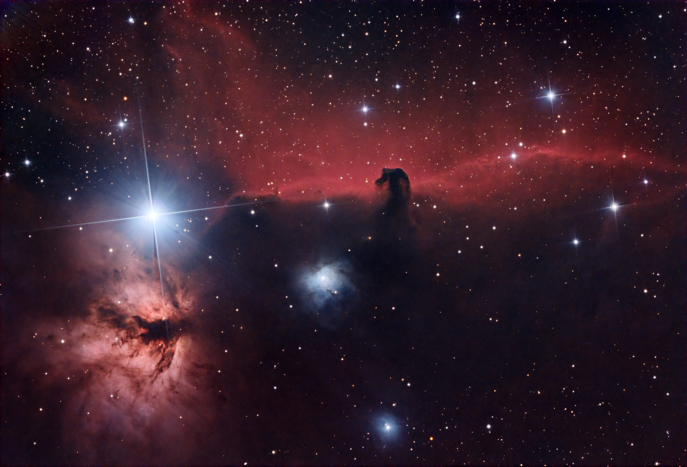
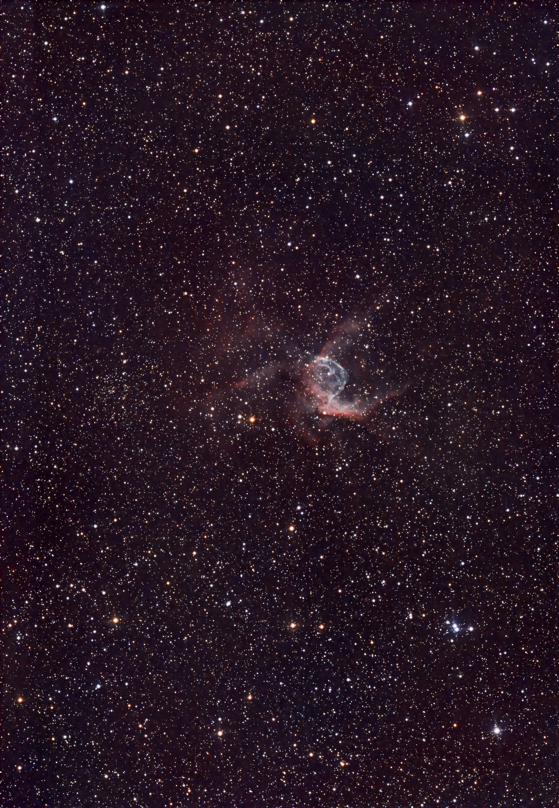
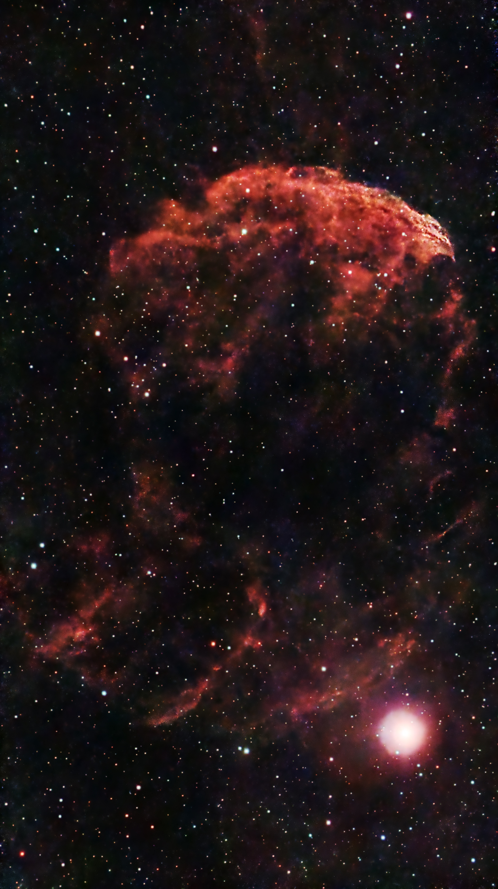

## 日記

私は、屈折望遠鏡が扱いやすくて好きだ。まぁ、赤道儀にのっけてすぐに撮影を始めても、それなりに撮影でき、それなりに良い結果がえられる容易さが屈折の良さだ。一方、**反射望遠鏡はなかなかに扱いが難しい**（と思う）。内部が空洞になっており、風によってすぐに望遠鏡のブレが生じる。内外部の恩田差による内部の気流の問題で、画像がゆらぎやすい。そして何よりも、大きいのでカメラを取り付けたときのバランスを取るのがなかなかに難しい。これらはすべて、後々得られる画像の質に大きく関わってくることである。

それでも、反射鏡なりのメリットがある。とにかくF値が明るいこと。口径が大きいからたくさんの光をセンサーに集めることができる。そのため、短時間の撮影でもかなり明るい画像を得ることができるのである。時短が必要なときは、強い味方となるのである。

というわけで、色々忙しくて天体に時間があまり割けないこの日は時短のメリットと扱い難さのデメリットをうまく消化してみようというメンタリティにより、R200SSを使用することにした（意味不明）。

あと、その横でSeestarを設置。こちらでくらげさんを撮影することとした

使用鏡筒
R200SS/SXP2/ASI294MCPro/HEUIB-II
SeestarS50

## 観測記録

### IC434

#### タイトル

IC434 馬頭星雲

#### 天体写真

#### 撮影データ

- Telescope: R200SS
- Camera: ASI294MCpro
- Filter: HEUIB-Ⅱ2''
- Mount: SXP2
- Guide: SV165+ASI120MMmini+IR/UVcut
- Setting: Gain100Temp-10Exp<180s x21fits>
- TotalExpose: 63.00min
- ImageCapture: ASI AIR plus
- Date: 2024/02/07 From Balcony
- Software: Bias<non>/Dark<non>/Flat<non>/FlatDark<non>

#### 所感

この日はあまり時間がなくて、１天体約１時間の割当となった。それでも、ここまで写るのがやはり反射望遠鏡のいいところだなぁと思う。反射の光条も、綺羅びやかな感じがあって好きだ。この光条をあまり好ましく言わない方もいるようだが、星の輝きを最大限に引き立たせる華やかさが反射鏡の良さでもあると私は思っている。

そういえば、この頃からストレッチにGHS(Generalized Hyperbolic Stretch)を使用している。このストレッチのいいところは、強調したい輝度領域を指定して、その輝度周辺のコントラストを上げることができることだ。このプロセスによって、ストレッチの微調整がより簡単になったように思う。今回は、燃木星雲の部分をより強調すべくGHSでのストレッチを併用してみた。うまく行っているかどうかは…まぁガチ勢が見れば微妙かもしれないが、私としては満足の行く仕上がりとなった。

### NGC2359

#### タイトル

トールのヘルメット

#### 天体写真

#### 撮影データ

- [ Target: NGC2359 <トールのヘルメット> ]
- Telescope: R200SS
- Camera: ASI294MCpro
- Filter: HEUIB-Ⅱ2''
- Mount: SXP2
- Guide: SV165+ASI120MMmini+IR/UVcut
- Setting: Gain100Temp-10Exp<180s x39fits>
- TotalExpose: 117.00min
- ImageCapture: ASI AIR plus
- Date: 2024/02/07 From Balcony
- Software: Bias<non>/Dark<non>/Flat<non>/FlatDark<non>

#### 所感

この対象は、2023年2月にSD115Sで一度撮影したのみ。北欧神話のトール神の名を関する星雲、神話好きの私にはなかなかに興味をそそられる対象だったが、意外と鏡筒を向けた機会が少なかったことに気づいて、この期に撮影した。焦点距離760mm+フォーサーズでの撮影で、このサイズ感…なかなかに小さい対象だ。それでも写りは悪くなく、満足行く結果となった。

ネットで見かける写真では、緑っぽい色合いに写っているものが多いが、私はそれに疑問を感じていた。天体写真では、緑に写る対象はほとんどないはず。これが一般常識ではないのか？どういうこと？

実際に自分で撮影し、PIで型通り処理してみると緑にはならない。薄青いバブル状の構造に淡い赤色の雲がひっついている感じだ。これが実物に近い色合いだろうか。

よく見ると、兜の角の部分だけでなく、兜の下側にも淡い分子雲がまとわりついているのがわかる。このような色の変化は、そこで起こっている自然の化学反応、もしくは原子レベルの反応に由来するものだろうが、なんとも複雑な形状を見るに、何らかの意志の介在を予感してしまう。

私だけ？

### IC443

#### タイトル

クラゲ星雲

#### 天体写真

#### 撮影データ

- [ Target: IC443 <クラゲ星雲> ]
- Telescope: SeestarS50
- Camera: 
- Filter: LP
- Mount: 
- Guide: 
- Setting: GainTempExp<20s x149fits>
- TotalExpose: 49.67min
- ImageCapture: 
- Date: 2024/02/07 From Balcony
- Software: Bias<non>/Dark<non>/Flat<non>/FlatDark<non>

#### 所感

この対象は、2023年2月にSD115Sで一度撮影したのみ。北欧神話のトール神の名を関する星雲、神話好きの私にはなかなかに興味をそそられる対象だったが、意外と鏡筒を向けた機会が少なかったことに気づいて、この期に撮影した。焦点距離760mm+フォーサーズでの撮影で、このサイズ感…なかなかに小さい対象だ。それでも写りは悪くなく、満足行く結果となった。

ネットで見かける写真では、緑っぽい色合いに写っているものが多いが、私はそれに疑問を感じていた。天体写真では、緑に写る対象はほとんどないはず。これが一般常識ではないのか？どういうこと？

実際に自分で撮影し、PIで型通り処理してみると緑にはならない。薄青いバブル状の構造に淡い赤色の雲がひっついている感じだ。これが実物に近い色合いだろうか。

よく見ると、兜の角の部分だけでなく、兜の下側にも淡い分子雲がまとわりついているのがわかる。このような色の変化は、そこで起こっている自然の化学反応、もしくは原子レベルの反応に由来するものだろうが、なんとも複雑な形状を見るに、何らかの意志の介在を予感してしまう。

私だけ？
そうじゃないだろうなぁｗ
