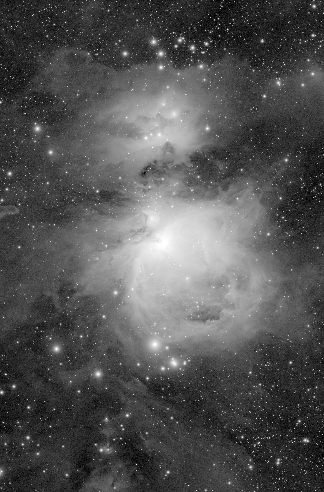
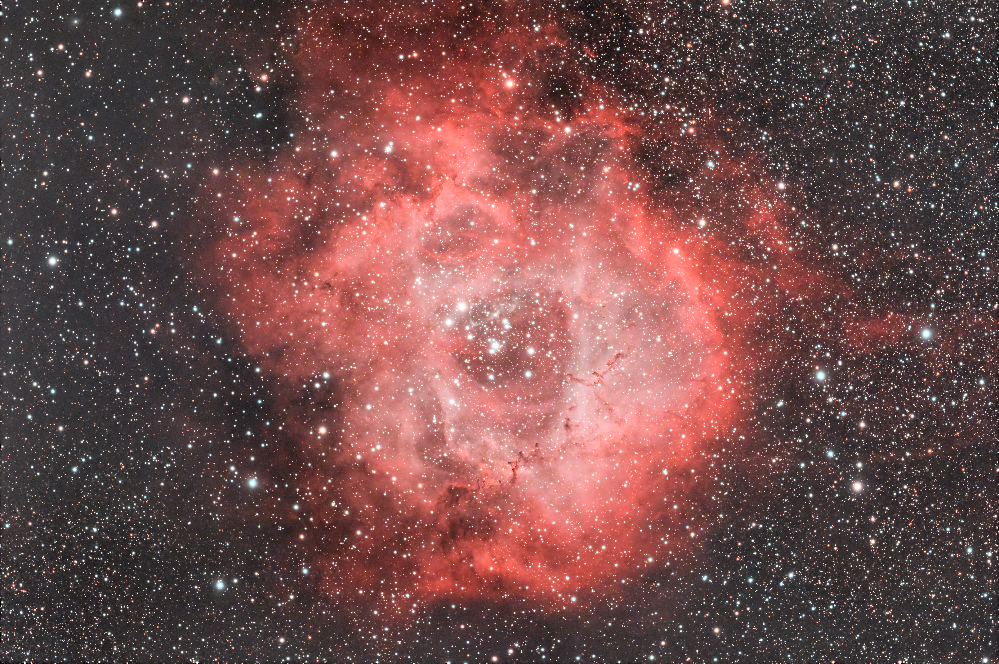

## 日記

今年一年の最後の通常勤務が終了した。いやまだ、12月30日の年末年始当番が残っているのだが、一応本日が仕事納めだ。
というわけで、空も晴れているし、また天体観測をしようか。

それにしても、この12月、特に後半は怒涛の忙しさだった。これはどの多忙は、開業以来始めてだ。本年最後の週末は、まさに目が回るという言葉がピッタリの激務…。明らかに一人でできる診療の能力を超えていた。よく乗り切れたものだと…。
そんな自分へのご褒美として、星空ハント。こんな人生最高！

image: diary-telescope.jpg
imageAlign: right

{large}{purple}Askar FF107APO/AM5/ASI2600MMpro/IRcut{/purple}{/large}

使用機材

12月上旬にFF107APOでM42やらバラ星雲やらを撮影していた。せっかくだから、それらRGB画像をより精細なものにすべく、LRGB用のL画像の撮影を試みた。久しぶりの2600MM登場だ。

## 観測記録

### M42

#### タイトル

M42 オリオン星雲

#### 天体写真

#### 撮影データ

- [ Target: M42 <オリオン星雲> ]
- Telescope: ZWO FF107APO + RDx0.69
- Camera: ASI2600MMpro
- Filter: IRカット 2''
- Mount: AM5
- Guide: ZWO30mmF4 + ASI120MMmini + IR/UVcut
- Setting: Gain100 Temp-10 Exp<180s x30fits> + <120s x35fits> + <60s x30fits>
- TotalExpose: 190min
- ImageCapture: ASI AIR plus
- Date: 2024/12/28 From Balcony
- Software: PI PS

#### 所感

12月10日に撮影したワンショットカラー画像と、この日に撮影したモノクロL画像をLRGB合成したもの。
先に撮っていたカラー画像に、より精細なL画像を重ねることで、星雲の淡い構造と中心部の階調をもう少し引き出す狙いだった。

久しぶりのモノクロカメラ運用だったが、やはりL画像の情報量は強い。カラーだけでは少し眠く見えていた部分が締まり、オリオン大星雲らしい迫力が戻ってきた。

### Sh2-275

#### タイトル

Sh2-275 バラ星雲

#### 天体写真

#### 撮影データ

- [ Target: NGC2237/Sh2-275 <バラ星雲> ]
- Telescope: ZWO FF107APO + RDx0.69
- Camera: ASI2600MMpro
- Filter: IRカット 2''
- Mount: AM5
- Guide: ZWO30mmF4 + ASI120MMmini + IR/UVcut
- Setting: Gain100 Temp-10 Exp<120s x30fits> + <180s x20fits> + <300s x23fits>
- TotalExpose: 235min
- ImageCapture: ASI AIR plus
- Date: 2024/12/28 From Balcony
- Software: PI PS

#### 所感

上記撮影画像を、12月22日に撮影したバラ星雲画像と合成。

赤い星雲の広がりがよく出ていて、冬の代表的な対象らしい華やかさがある。淡い外縁部まで拾えており、仕事納めの夜に狙う対象としてはかなり満足度の高い仕上がりになった。
